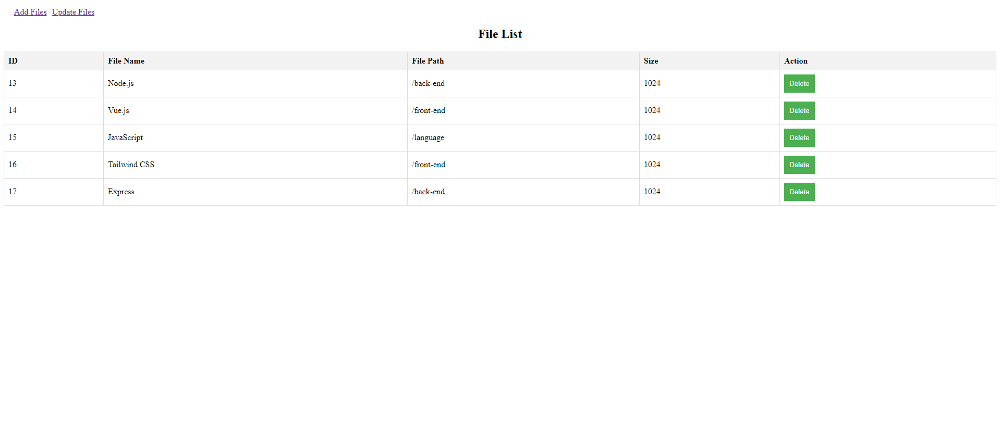

# file-management-system

A simple file management system with CRUD (Create, Read, Update and Delete) functionalities for testing purposes.



### Prerequisites

Before you can run the application, make sure you have Node.js installed on your system. You can download it from [Node.js official website](https://nodejs.org/). After installing Node.js, you will have access to the `npm` and `npx` commands.

### Installation

First, clone the repository to your local machine:
```
git clone https://github.com/aizatnazran/file-management-system.git
```
Open the front-end and back-end root folder in terminal individually
```
cd file-management-system/front-end
cd file-management-system/Back-end
```

### Running the Application

To start the application, run the following command in the root directory of your back-end project
```
node server.js
```
And run the following command in the root directory of your front-end project
```
npm run serve
```
This command will start both the front-end and back-end server.
